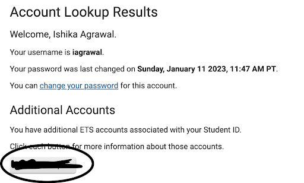
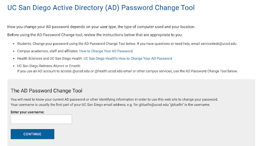
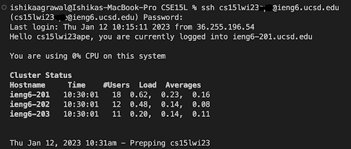
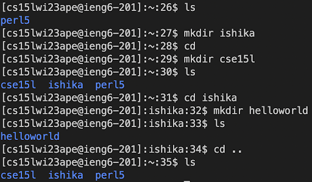

# Week 1 Lab Report
## INSTALLING VS CODE
* Check the website https://code.visualstudio.com/ and follow the instructions to install VS Code.
* It should look like this after installation:

## REMOTELY CONNECTING
* Look up your account username using this link: https://sdacs.ucsd.edu/~icc/index.php

* Reset the password and wait for a few minutes

* Now open a terminal on VS Code and type in the following command (Replace XXX with your account username for CSE15L):
> ssh XXX@ieng6.ucsd.edu

* Next, when prompted, type “yes” into the terminal.
* Now, enter your password. Don’t worry if nothing appears on the screen while you are typing your password - that’s how it works in the terminal!

* This is what the setup would look like:

## TRYING SOME COMMANDS
* I created a directory “ishika” and “cse15l” using _mkdir_
* Then I navigate into the “ishika” directory using _cd_
* Then I create another directory “helloworld” inside “ishika”
* I display all directories using _ls_

